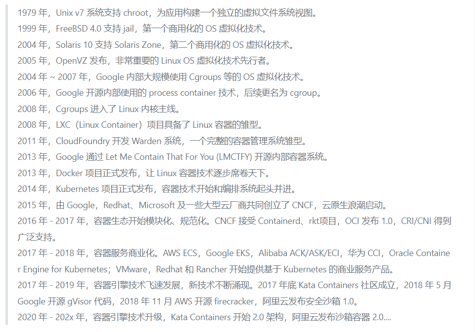
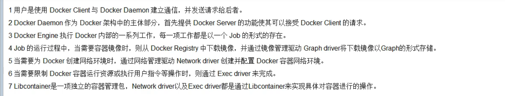
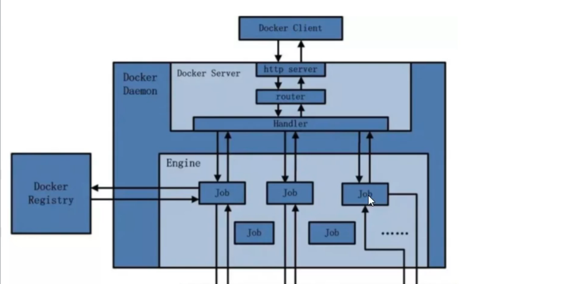
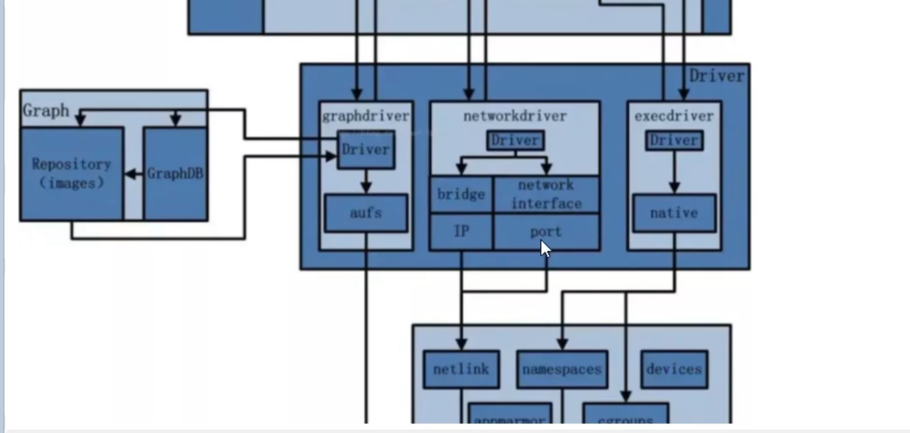
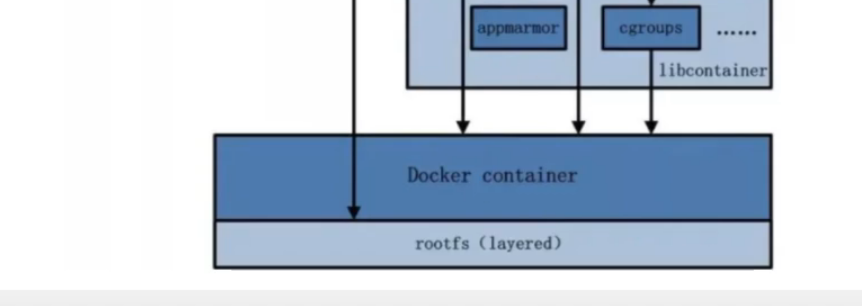

# 一、简介

## 1.1 docker是什么

### 1.1.1 docker理念

Docker是基于Go语言实现的云开源项目。Docker的主要目标是“Build，Ship and Run Any App,Anywhere”，也就是通过对应用组件的封装、分发、部署、运行等生命周期的管理，使用户的APP（可以是一个WEB应用或数据库应用等等）及其运行环境能够做到“一次镜像，处处运行”。Linux容器技术的出现就解决了这样一个问题，而 Docker 就是在它的基础上发展过来的。将应用打成镜像，通过镜像成为运行在Docker容器上面的实例，而 Docker容器在任何操作系统上都是一致的，这就实现了跨平台、跨服务器。只需要一次配置好环境，换到别的机子上就可以一键部署好，大大简化了操作。

### 1.1.2 为什么会有docker出现

假定您在开发一个尚硅谷的谷粒商城，您使用的是一台笔记本电脑而且您的开发环境具有特定的配置。其他开发人员身处的环境配置也各有不同。您正在开发的应用依赖于您当前的配置且还要依赖于某些配置文件。此外，您的企业还拥有标准化的测试和生产环境，且具有自身的配置和一系列支持文件。您希望尽可能多在本地模拟这些环境而不产生重新创建服务器环境的开销。请问？您要如何确保应用能够在这些环境中运行和通过质量检测？并且在部署过程中不出现令人头疼的版本、配置问题，也无需重新编写代码和进行故障修复？ 答案就是使用容器。Docker之所以发展如此迅速，也是因为它对此给出了一个标准化的解决方案-----系统平滑移植，容器虚拟化技术。 环境配置相当麻烦，换一台机器，就要重来一次，费力费时。很多人想到，能不能从根本上解决问题，软件可以带环境安装？也就是说，安装的时候，把原始环境一模一样地复制过来。开发人员利用 Docker 可以消除协作编码时“在我的机器上可正常工作”的问题。  之前在服务器配置一个应用的运行环境，要安装各种软件，就拿尚硅谷电商项目的环境来说，Java/RabbitMQ/MySQL/JDBC驱动包等。安装和配置这些东西有多麻烦就不说了，它还不能跨平台。假如我们是在 Windows 上安装的这些环境，到了 Linux 又得重新装。况且就算不跨操作系统，换另一台同样操作系统的服务器，要移植应用也是非常麻烦的。传统上认为，软件编码开发/测试结束后，所产出的成果即是程序或是能够编译执行的二进制字节码等(java为例)。而为了让这些程序可以顺利执行，开发团队也得准备完整的部署文件，让维运团队得以部署应用程式，开发需要清楚的告诉运维部署团队，用的全部配置文件+所有软件环境。不过，即便如此，仍然常常发生部署失败的状况。Docker的出现使得Docker得以打破过去「程序即应用」的观念。透过镜像(images)将作业系统核心除外，运作应用程式所需要的系统环境，由下而上打包，达到应用程式跨平台间的无缝接轨运作。

### 1.1.3 小结

解决了运行环境和配置问题的软件容器，
方便做持续集成并有助于整体发布的容器虚拟化技术。

## 1.2 容器与虚拟机比较

### 1.2.1 发展史

### 1.2.2 传统虚拟机技术

虚拟机（virtual machine）就是带环境安装的一种解决方案。它可以在一种操作系统里面运行另一种操作系统，比如在Windows10系统里面运行Linux系统CentOS7。应用程序对此毫无感知，因为虚拟机看上去跟真实系统一模一样，而对于底层系统来说，虚拟机就是一个普通文件，不需要了就删掉，对其他部分毫无影响。这类虚拟机完美的运行了另一套系统，能够使应用程序，操作系统和硬件三者之间的逻辑不变。  Win10VMWareCentos7各种cpu、内存网络额配置+各种软件虚拟机实例 虚拟机的缺点：

1. 资源占用多
2. 冗余步骤多
3. 启动慢

### 1.2.3 容器虚拟化技术

由于前面虚拟机存在某些缺点，Linux发展出了另一种虚拟化技术：Linux容器(Linux Containers，缩写为 LXC)Linux容器是与系统其他部分隔离开的一系列进程，从另一个镜像运行，并由该镜像提供支持进程所需的全部文件。容器提供的镜像包含了应用的所有依赖项，因而在从开发到测试再到生产的整个过程中，它都具有可移植性和一致性。 Linux 容器不是模拟一个完整的操作系统而是对进程进行隔离。有了容器，就可以将软件运行所需的所有资源打包到一个隔离的容器中。容器与虚拟机不同，不需要捆绑一整套操作系统，只需要软件工作所需的库资源和设置。系统因此而变得高效轻量并保证部署在任何环境中的软件都能始终如一地运行。

### 1.2.4 对比

比较了 Docker 和传统虚拟化方式的不同之处：传统虚拟机技术是虚拟出一套硬件后，在其上运行一个完整操作系统，在该系统上再运行所需应用进程；*容器内的应用进程直接运行于宿主的内核，容器内没有自己的内核且也没有进行硬件虚拟。因此容器要比传统虚拟机更为轻便。* 每个容器之间互相隔离，每个容器有自己的文件系统 ，容器之间进程不会相互影响，能区分计算资源。

## 1.3 docker能干嘛

### 1.3.1 技术路径

开发职责演进

coder----programmer----software engineer----DevOps engineer

### 1.3.2 新一代开发工程师

#### 一次构建随处运行

##### 给更快的应用交付和部署

传统的应用开发完成后，需要提供一堆安装程序和配置说明文档，安装部署后需根据配置文档进行繁杂的配置才能正常运行。Docker化之后只需要交付少量容器镜像文件，在正式生产环境加载镜像并运行即可，应用安装配置在镜像里已经内置好，大大节省部署配置和测试验证时间。

##### 更便捷的升级和扩缩容

随着微服务架构和Docker的发展，大量的应用会通过微服务方式架构，应用的开发构建将变成搭乐高积木一样，每个Docker容器将变成一块“积木”，应用的升级将变得非常容易。当现有的容器不足以支撑业务处理时，可通过镜像运行新的容器进行快速扩容，使应用系统的扩容从原先的天级变成分钟级甚至秒级。

##### 更简单的系统运维

应用容器化运行后，生产环境运行的应用可与开发、测试环境的应用高度一致，容器会将应用程序相关的环境和状态完全封装起来，不会因为底层基础架构和操作系统的不一致性给应用带来影响，产生新的BUG。当出现程序异常时，也可以通过测试环境的相同容器进行快速定位和修复。

##### 更高效的计算资源利用

Docker是内核级虚拟化，其不像传统的虚拟化技术一样需要额外的Hypervisor支持，所以在一台物理机上可以运行很多个容器实例，可大大提升物理服务器的CPU和内存的利用率。

### 1.3.2 使用企业

基本80%以上的软件企业都已经使用云原生部署

## 1.4 网址

官网  docker官网：http://www.docker.com

仓库  Docker Hub官网: https://hub.docker.com/

# 二、安装

## 2.1 说明

CentOS Docker 安装前提条件目前，CentOS 仅发行版本中的内核支持 Docker。Docker 运行在CentOS 7 (64-bit)上，要求系统为64位、Linux系统内核版本为 3.8以上，这里选用Centos7.x 查看自己的内核uname命令用于打印当前系统相关信息（内核版本号、硬件架构、主机名称和操作系统类型等）。

## 2.2 docker的基本组成

### 2.2.1 镜像

Docker 镜像（Image）就是一个只读的模板。镜像可以用来创建 Docker 容器，一个镜像可以创建很多容器。它也相当于是一个root文件系统。比如官方镜像 centos:7 就包含了完整的一套 centos:7 最小系统的 root 文件系统。相当于容器的“源代码”，docker镜像文件类似于Java的类模板，而docker容器实例类似于java中new出来的实例对象。

### 2.2.2 容器

1 从面向对象角度Docker 利用容器（Container）独立运行的一个或一组应用，应用程序或服务运行在容器里面，容器就类似于一个虚拟化的运行环境，容器是用镜像创建的运行实例。就像是Java中的类和实例对象一样，镜像是静态的定义，容器是镜像运行时的实体。容器为镜像提供了一个标准的和隔离的运行环境，它可以被启动、开始、停止、删除。每个容器都是相互隔离的、保证安全的平台 2 从镜像容器角度可以把容器看做是一个简易版的 Linux 环境（包括root用户权限、进程空间、用户空间和网络空间等）和运行在其中的应用程序。

### 2.2.3 仓库

仓库（Repository）是集中存放镜像文件的场所。 类似于Maven仓库，存放各种jar包的地方；github仓库，存放各种git项目的地方；Docker公司提供的官方registry被称为Docker Hub，存放各种镜像模板的地方。 仓库分为公开仓库（Public）和私有仓库（Private）两种形式。最大的公开仓库是 Docker Hub(https://hub.docker.com/)，存放了数量庞大的镜像供用户下载。国内的公开仓库包括阿里云 、网易云等

### 2.2.4 小结

需要正确的理解仓库/镜像/容器这几个概念:Docker 本身是一个容器运行载体或称之为管理引擎。我们把应用程序和配置依赖打包好形成一个可交付的运行环境，这个打包好的运行环境就是image镜像文件。只有通过这个镜像文件才能生成Docker容器实例(类似Java中new出来一个对象)。 image文件可以看作是容器的模板。Docker 根据 image 文件生成容器的实例。同一个 image 文件，可以生成多个同时运行的容器实例。 镜像文件*  image 文件生成的容器实例，本身也是一个文件，称为镜像文件。容器实例*  一个容器运行一种服务，当我们需要的时候，就可以通过docker客户端创建一个对应的运行实例，也就是我们的容器仓库* 就是放一堆镜像的地方，我们可以把镜像发布到仓库中，需要的时候再从仓库中拉下来就可以了。

## 2.3 docker平台架构

- 整体架构及底层通信原理简述

Docker 是一个 C/S 模式的架构，后端是一个松耦合架构，众多模块各司其职。

## 2.4 docker安装步骤

### 2.4.1 环境

- yum安装gcc相关
- 安装需要软件包
- 设置stable镜像仓库

官网

`yum-config-manager --add-repo https://download.docker.com/linux/centos/docker-ce.repo`

自定义

`yum-config-manager --add-repo http://mirrors.aliyun.com/docker-ce/linux/centos/docker-ce.repo`

更新yum软件包索引

`yum makecache fast`
安装docker CE

`yum -y install docker-ce docker-ce-cli containerd.io`

### 2.4.2 docker操作

启动docker

`systemctl start docker`
测试

`docker version`

卸载命令

`systemctl stop docker`

`yum remove docker-ce docker-ce-cli containerd.io`

`rm -rf /var/lib/docker`

`rm -rf /var/lib/containerd`

### 2.4.3 镜像加速

拉去镜像太慢，可以选择镜像加速

修改 vim/etc/docker/daemon.json文件中的registry-mirrors配置

重启服务器

`systemctl daemon-reload`

重启docker

`systemctl restart docker`

## 2.5 docker底层原理

### 2.5.1 docker为什么比虚拟机快

(1)docker有着比虚拟机更少的抽象层   由于docker不需要Hypervisor(虚拟机)实现硬件资源虚拟化,运行在docker容器上的程序直接使用的都是实际物理机的硬件资源。因此在CPU、内存利用率上docker将会在效率上有明显优势。(2)docker利用的是宿主机的内核,而不需要加载操作系统OS内核   当新建一个容器时,docker不需要和虚拟机一样重新加载一个操作系统内核。进而避免引寻、加载操作系统内核返回等比较费时费资源的过程,当新建一个虚拟机时,虚拟机软件需要加载OS,返回新建过程是分钟级别的。而docker由于直接利用宿主机的操作系统,则省略了返回过程,因此新建一个docker容器只需要几秒钟。

# 三、基础命令

## 帮助类启动命令

###### 启动docker:

 `systemctl start docker`

###### 停止docker：

`systemctl stop docker`

###### 重启docker：

`systemctl restart docker`

###### 查看docker状态：

`systemctl status docker`

###### 开机启动：

`systemctl enable docker`

###### 查看docker概要信息：

`docker info`

###### 查看docker总体帮助文档：

`docker --help`

###### 查看docker命令帮助文档：

`docker 具体命令 --help`

## 镜像命令

## 容器命令

## 小结
