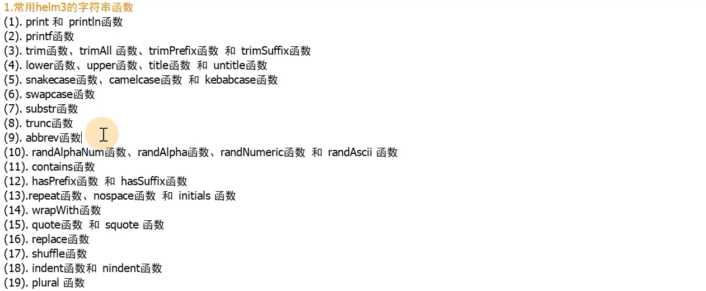

# 一、helm的使用和安装

介绍和安装部分直接参照官网介绍

`https://helm.sh/docs/`

# 二、Helm的内置对象

## 2.1 helm3常用内置对象如下：

Release 对象

Value 对象

Chart 对象

Capabilities 对象

Template 对象

## 2.2 各内置对象详解：

### .Release 对象（描述版本发布自身的一些信息。它包含了以下对象）

.Release.Name  --release的名称

.Release.Namespace --release的命名空间

.Release.IsUpgrade --如果当前操作是升级或者回滚，该值为true

.Release.IsInstall --如果当前操作为安装的话，该值为ture

.Release.Revision --获取此次修订的版本号。初次安装时为1，每次升级或者回滚都会递增

.Release.Service --获取渲染当模板的服务名称。一般都是Helm

### .Values 对象（描述的是values.yaml文件中变量的内容，默认为空。使用Values对象获取values.yaml文件中定义变量的值）

假设在values.yaml文件中有如下

```
name: test
```

则可以通过 `.Value.name`获取name的值

### .Chart 对象 （获取Chart.yaml文件中的内容）

例如下:

.Chart.Name -- 获取Chart的名称

.Chart.Version -- 获取Chart的版本

### .Capabilities对象 （提供关于kubernetes集群的相关的信息）

.Capabilities.APIVersions  --返回k8s的api信息集合

.Capabilities.APIVerisons.Has ＄ --检测指定的版本或资源在k8s集群中是否可用

.Capabilities.KubeVersion.Version --用于获取kubernetes的版本号

.Capabilities.KubeVersion.Major -- 获取kubernetes的主版本号

.Capabilities.KuberVsuib.minor -- 获取k8s的小版本号

### .Template对象

.Template.name --用于获取当前模板的名称和路径

.Template.BasePath -- 用于获取当前模板路径

# 三、Helm常用命令与函数

## 3.1 常用命令如下图：


## 3.2  内置函数介绍

### 常见模板内置函数

.quote 双引号 `""`或者 squote 单引号 `''`函数  --获取的变量值加引号

.upper 和lower --获取的变量大写或者小写

. repeat函数 --获取的值，指定重复次数

. default函数 --指定值的默认值

. lookup函数 --寻找k8s中指定的资源,返回一个字典对象

### 常见逻辑和流控制函数


### 常见的字符串函数



### 其他常见函数

getHostByName -- 解析域名返回ip

bash，dir，ext，isAbs  --文件路径函数


类型函数


