# 1 云计算是什么

## 1.1 云计算简介

云计算不是新技术，是一种新的互联网模式，通过使用公有云或者私有云资源，便捷、快速的为我们提供服务

通过分布式、虚拟化技术在自动化平台上更深层的解决方案

云分为私有云、公有云、混合云

云中的资源在使用者看来是可以无限扩展的，并且可以随时获取，按需使用，随时扩展，按使用付费。这种特性经常被称为像水电一样使用IT基础设施。

## 1.2 云计算发展历程

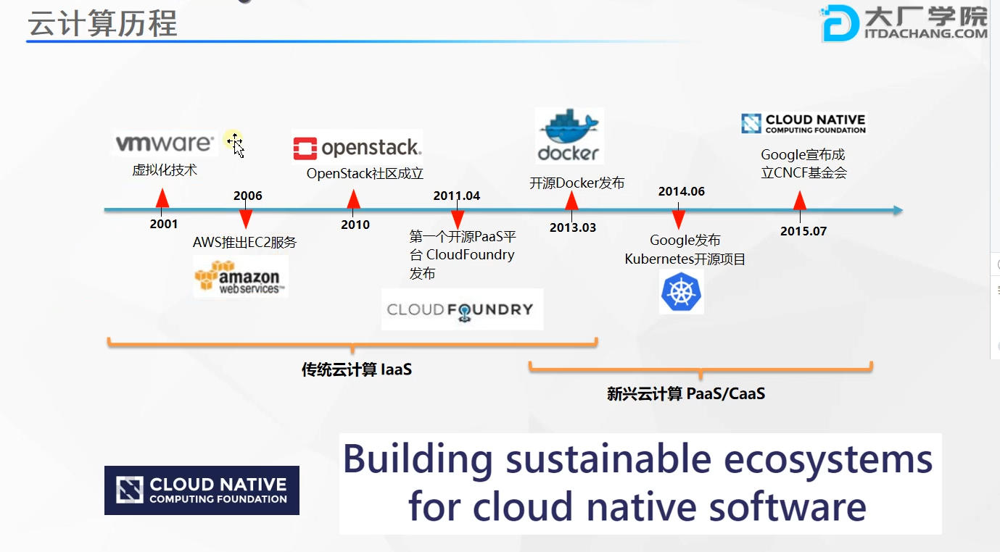

openstack管硬件的

docker主要是应用容器化软件

openstack系列称为基础设施编排（硬应用）

kubernets称为应用编排（软应用）

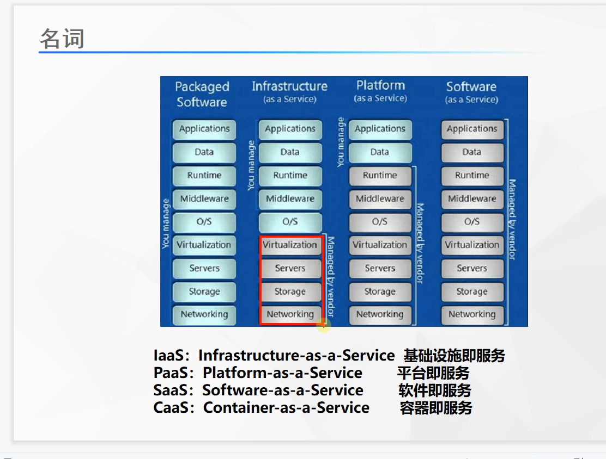

## 1.3 云平台的优缺点

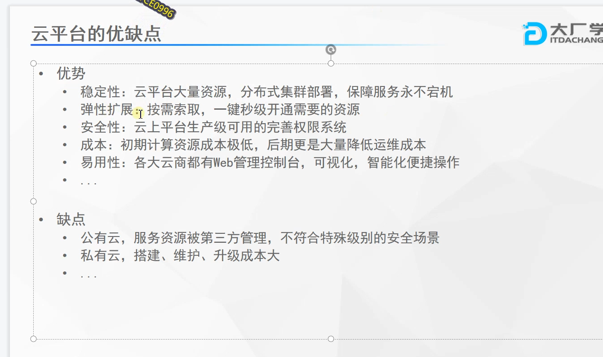

## 1.4 分布式和集群的区别

一个完整的应用，拆分很多个不同的模块，各个功能部署在不同的服务器，所有这些服务器合起来称为一个分布式应用

集群很多服务器都可以称为集群，单不同服务部署到不同服务才能称为分布式

## 1.5 架构演进

### 1.5.1 微服务架构

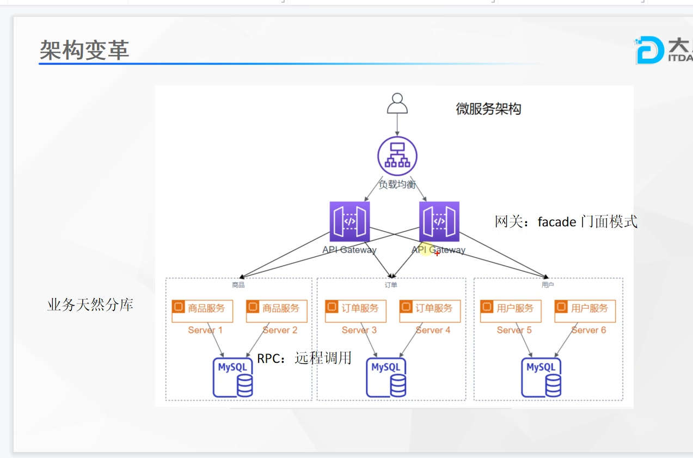

gateway层和nginx的区别

gateway可以做业务层的处理，nginx其实只专注负载均衡

### 1.5.2 网格化架构

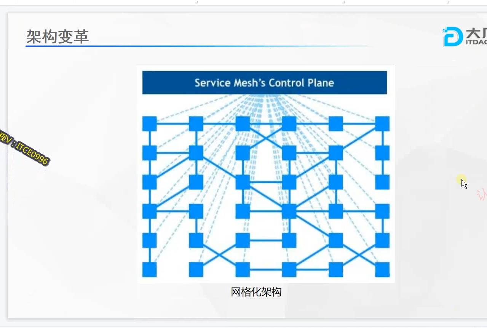

## 1.6 kubernets生态

应用上云无关语言

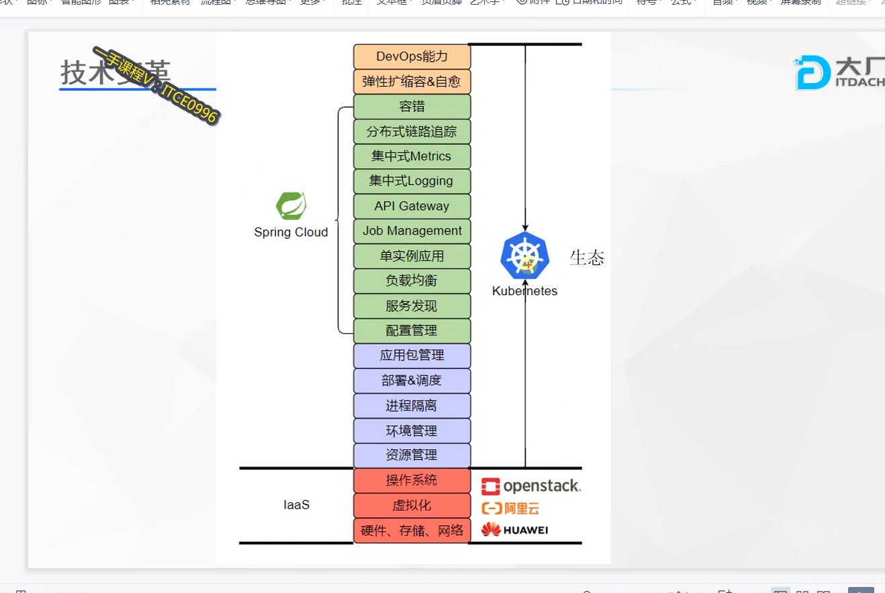

应用上云的新型架构就是：k8s+serviceMesh

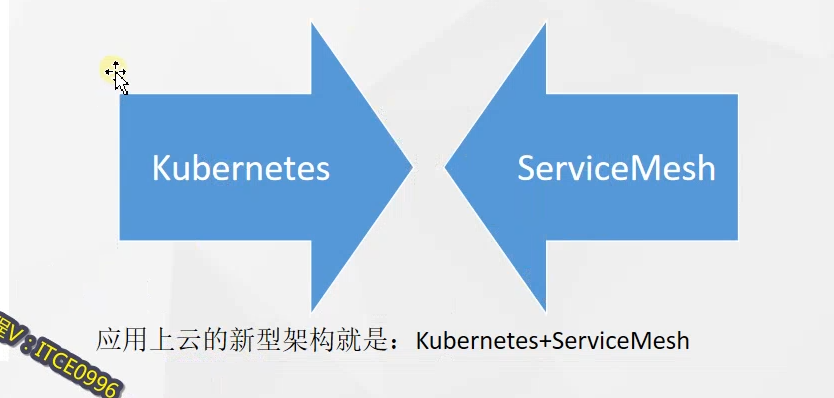

1.7 云原生的生态系统

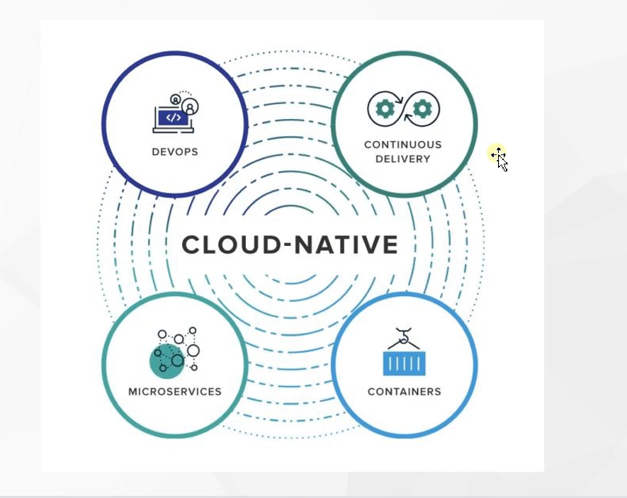

# 2 docker

## 2.1 docker架构

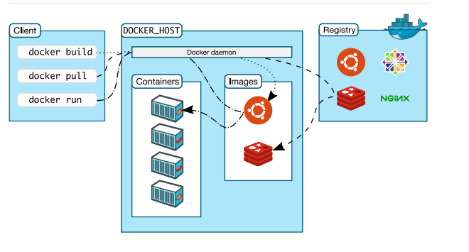

**名称解释**

K8S：CRI（Container Runtime Interface）
Client： 客户端；操作docker服务器的客户端（命令行或者界面）
Docker_Host：Docker主机；安装Docker服务的主机
Docker_Daemon：后台进程；运行在Docker服务器的后台进程
Containers：容器；在Docker服务器中的容器（一个容器一般是一个应用实例，容器间互相隔离）
Images：镜像、映像、程序包；Image是只读模板，其中包含创建Docker容器的说明。容器是由Image运行而来，Image固定不变。
Registries：仓库；存储Docker Image的地方。官方远程仓库地址： https://hub.docker.com/search

> Docker用Go编程语言编写，并利用Linux内核的多种功能来交付其功能。 Docker使用一种称为名称空间的技术来提供容器的隔离工作区。 运行容器时，Docker会为该容器创建一组名称空间。 这些名称空间提供了一层隔离。 容器的每个方面都在单独的名称空间中运行，并且对其的访问仅限于该名称空间。

- 容器与虚拟机

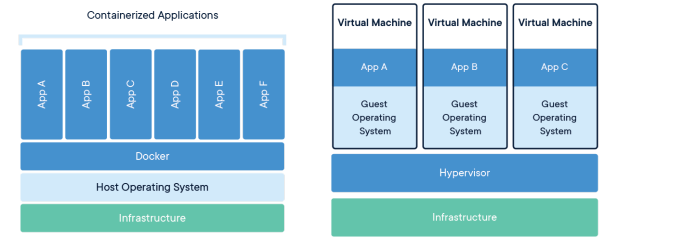

## 2.2 Docker隔离原理

### 2.2.1 namespace 6项隔离 （资源隔离）

| namespace | 系统调用参数  | 隔离内容                   |
| --------- | ------------- | -------------------------- |
| UTS       | CLONE_NEWUTS  | 主机和域名                 |
| IPC       | CLONE_NEWIPC  | 信号量、消息队列和共享内存 |
| PID       | CLONE_NEWPID  | 进程编号                   |
| Network   | CLONE_NEWNET  | 网络设备、网络栈、端口等   |
| Mount     | CLONE_NEWNS   | 挂载点(文件系统)           |
| User      | CLONE_NEWUSER | 用户和用户组               |

## 2.2.2 cgroups资源限制 （资源限制）

cgroup提供的主要功能如下：

- 资源限制：限制任务使用的资源总额，并在超过这个 配额 时发出提示
- 优先级分配：分配CPU时间片数量及磁盘IO带宽大小、控制任务运行的优先级
- 资源统计：统计系统资源使用量，如CPU使用时长、内存用量
- 任务控制：对任务执行挂起、恢复等操作

cgroup资源控制系统，每种子系统独立地控制一种资源。功能如下

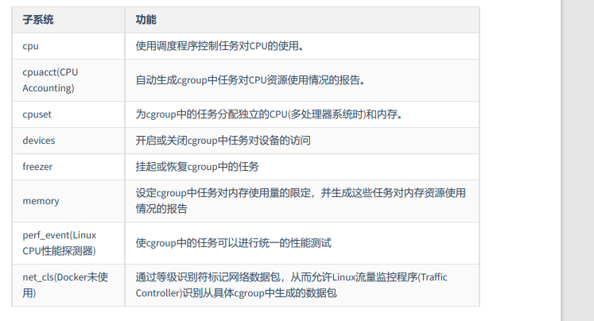

## 2.3 Docker安装

以下以centos为例；
更多其他安装方式，详细参照文档： https://docs.docker.com/engine/install/centos/

省略

## 2.4 Docker命令

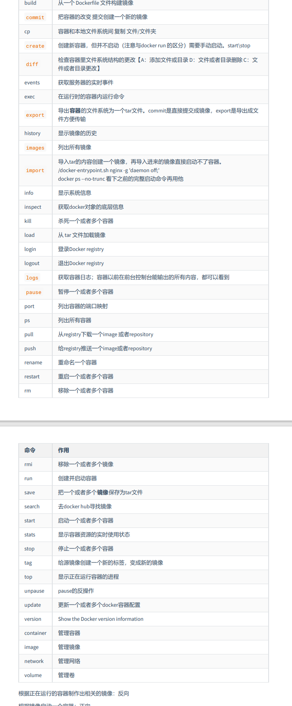

详见 `https://github.com/fantast1211/mario-note/blob/main/linux/%E5%AE%B9%E5%99%A8%E6%8A%80%E6%9C%AF/docker%E5%85%A5%E9%97%A8.md`

根据正在运行的容器制作出相关的镜像：反向
根据镜像启动一个容器：正向
有了Docker：
1、先去软件市场搜镜像：https://registry.hub.docker.com/ docker hub
2、下载镜像 docker pull xxx
3、启动软件 docker run 镜像名；
对于镜像的所有管理操作都在这一个命令：docker image --help

## 2.5 Docker命令逻辑图

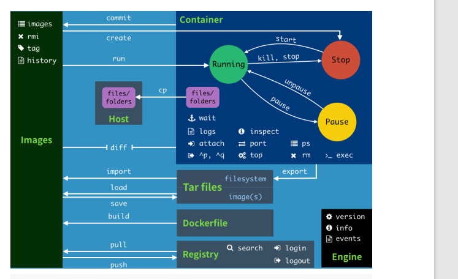

## 2.6 Docker存储

### 2.6.1 镜像是如何存储的

#### 2.6.1.1 Images and layers

Docker映像由一系列层组成。每层代表图像的Dokerfile中的一条指令。除最后一层外的每一层都是只读的。如以下Dockerfile:

```shell
FROM ubuntu:15.04
COPY . /app
RUN make /app
CMD python /app/app.py
```

可以通过

`docker history image`命令查看容器镜像

该Dockerfile包含四个命令，每个命令创建一个层。
FROM语句从ubuntu：15.04映像创建一个图层开始。
COPY命令从Docker客户端的当前目录添加一些文件。
RUN命令使用make命令构建您的应用程序。
最后，最后一层指定要在容器中运行的命令。
每一层只是与上一层不同的一组。 这些层彼此堆叠。
创建新容器时，可以在基础层之上添加一个新的可写层。 该层通常称为“容器层”。 对运行中的容器所做的所有更改（例如写入新文件，修改现有文件和删除文件）都将写入此薄可写容器层。

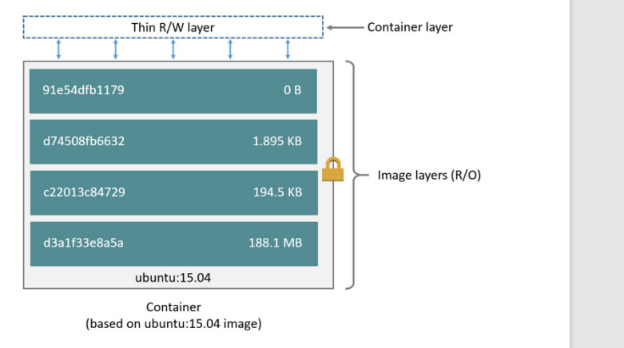

#### 2.6.1.2 Container and layers

容器和镜像之间的主要区别是可写顶层。
在容器中添加新数据或修改现有数据的所有写操作都存储在此可写层中。
删除容器后，可写层也会被删除。 基础图像保持不变。 因为每个容器都有其自己的可写容
器层，并且所有更改都存储在该容器层中，所以多个容器可以共享对同一基础映像的访问，但具有自己的数据状态。


下图显示了共享同一Ubuntu 15.04映像的多个容器。

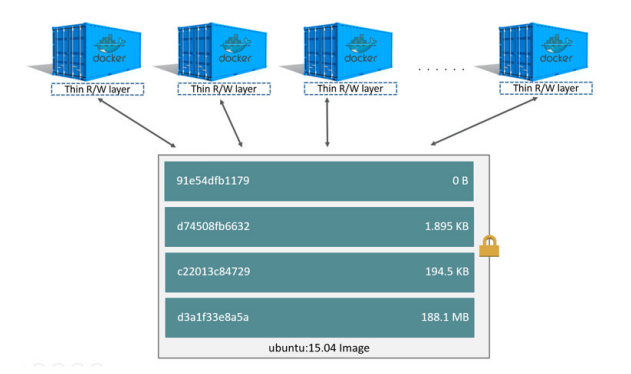

#### 2.6.1.3 磁盘容量预估

```shell
docker ps -s
size：用于每个容器的可写层的数据量（在磁盘上）。
virtual size：容器使用的用于只读图像数据的数据量加上容器的可写图层大小。
多个容器可以共享部分或全部只读图像数据。
从同一图像开始的两个容器共享100％的只读数据，而具有不同图像的两个容器（具有相同的层）共享这些公共层。 因此，不能只对虚拟大小进行总计。这高估了总磁盘使用量，可能是一笔不小的数目。
```

#### 2.6.1.4 镜像如何挑选

```shell
busybox：是一个集成了一百多个最常用Linux命令和工具的软件。linux工具里的瑞士军刀
alpine：Alpine操作系统是一个面向安全的轻型Linux发行版经典最小镜像，基于busybox，功能比
Busybox完善。
slim：docker hub中有些镜像有slim标识，都是瘦身了的镜像。也要优先选择
无论是制作镜像还是下载镜像，优先选择alpine类型.
```

#### 2.6.1.5 copy on write

- 写时复制是一种共享和复制文件的策略，可最大程度地提高效率。
- 如果文件或目录位于映像的较低层中，而另一层（包括可写层）需要对其进行读取访问，则它仅使
  用现有文件。
- 另一层第一次需要修改文件时（在构建映像或运行容器时），将文件复制到该层并进行修改。 这
  样可以将I / O和每个后续层的大小最小化。

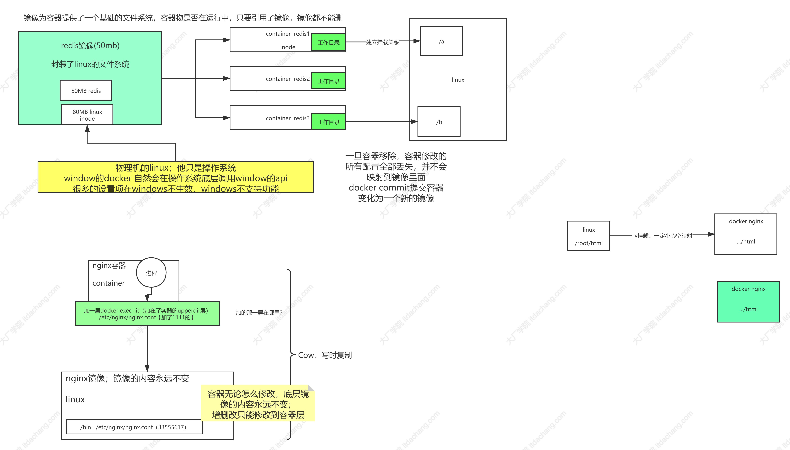


# 存储

## 1 卷(Volume)

Container 中的文件在磁盘上是临时存放的，这给 Container 中运行的较重要的应用程序带来一些问题。 问题之一是当容器崩溃时文件丢失。 kubelet 会重新启动容器，但容器会以干净的状态重启。 第二个问题会在同一 `Pod` 中运行多个容器并共享文件时出现。Kubernetes卷(Volume)这一抽象概念能够解决这两个问题。

### 1.1 背景

Docker 也有Volume的概念，但对它只有少量且松散的管理。 Docker 卷是磁盘上或者另外一个容器内的一个目录。 Docker 提供卷驱动程序，但是其功能非常有限。

Kubernetes 支持很多类型的卷。 [Pod](https://kubernetes.io/zh-cn/docs/concepts/workloads/pods/) 可以同时使用任意数目的卷类型。 临时卷类型的生命周期与 Pod 相同，但持久卷可以比 Pod 的存活期长。 当 Pod 不再存在时，Kubernetes 也会销毁临时卷；不过 Kubernetes 不会销毁持久卷。 对于给定 Pod 中任何类型的卷，在容器重启期间数据都不会丢失。

### 1.2 介绍

容器中的文件在磁盘上是临时存放的，当容器重建时，容器中的文件将会丢失，另外当在一个Pod中同时运行多个容器时，常常需要在这些容器之间共享文件，这也是容器不好解决的问题。 Kubernetes抽象出了Volume来解决这两个问题，也就是存储卷，Kubernetes的Volume是Pod的一部分，Volume不是单独的对象，不能独立创建，只能在Pod中定义。

Pod中的所有容器都可以访问Volume，但必须要挂载，且可以挂载到容器中任何目录。

实际中使用容器存储如下图所示，将容器的内容挂载到Volume中，通过Volume两个容器间实现了存储共享。

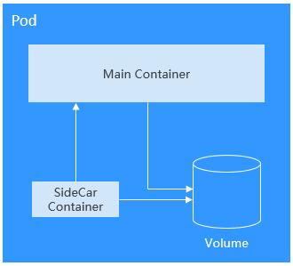

Volume的生命周期与挂载它的Pod相同，但是Volume里面的文件可能在Volume消失后仍然存在，这取决于Volume的类型。

### 1.3 Volume的类型

Kubernetes的Volume有非常多的类型，在实际使用中使用最多的类型如下。

* emptyDir：一种简单的空目录，主要用于临时存储。
* hostPath：将主机某个目录挂载到容器中。
* ConfigMap、Secret：特殊类型，将Kubernetes特定的对象类型挂载到Pod，在[ConfigMap](https://support.huaweicloud.com/basics-cce/kubernetes_0020.html)和[Secret](https://support.huaweicloud.com/basics-cce/kubernetes_0021.html)章节介绍过如何将ConfigMap和Secret挂载到Volume中。
* persistentVolumeClaim：Kubernetes的持久化存储类型，详细介绍请参考[PV、PVC和StorageClass](https://support.huaweicloud.com/basics-cce/kubernetes_0030.html)中会详细介绍。

### 1.4 EmptyDir

EmptyDir是最简单的一种Volume类型，根据名字就能看出，这个Volume挂载后就是一个空目录，应用程序可以在里面读写文件，emptyDir Volume的生命周期与Pod相同，Pod删除后Volume的数据也同时删除掉。

emptyDir的一些用途：

* 缓存空间，例如基于磁盘的归并排序。
* 为耗时较长的计算任务提供检查点，以便任务能从崩溃前状态恢复执行。

emptyDir配置示例如下。

```yaml
apiVersion: v1
kind: Pod
metadata:
  name: nginx
spec:
  containers:
  - image: nginx:alpine
    name: test-container
    volumeMounts:
    - mountPath: /cache
      name: cache-volume
  volumes:
  - name: cache-volume
    emptyDir: {}
```

emptyDir实际是将Volume的内容写在Pod所在节点的磁盘上，另外emptyDir也可以设置存储介质为内存，如下所示，medium设置为Memory。

```yaml
volumes:
  - name: html
    emptyDir:
      medium: Memory
```

### 1.5 Hostpath

HostPath是一种持久化存储，emptyDir里面的内容会随着Pod的删除而消失，但HostPath不会，如果对应的Pod删除，HostPath Volume里面的内容依然存在于节点的目录中，如果后续重新创建Pod并调度到同一个节点，挂载后依然可以读取到之前Pod写的内容。

HostPath存储的内容与节点相关，所以它不适合像数据库这类的应用，想象下如果数据库的Pod被调度到别的节点了，那读取的内容就完全不一样了。

记住永远不要使用HostPath存储跨Pod的数据，一定要把HostPath的使用范围限制在读取节点文件上，这是因为Pod被重建后不确定会调度哪个节点上，写文件可能会导致前后不一致。

```yaml
apiVersion: v1
kind: Pod
metadata:
  name: test-hostpath
spec:
  containers:
  - image: nginx:alpine
    name: hostpath-container
    volumeMounts:
    - mountPath: /test-pd
      name: test-volume
  volumes:
  - name: test-volume
    hostPath:
      path: /data
```

## 1.6 云原生的12要素

## 2 PV、PVC和StorageClass

### 2.1 介绍

上一小节的HostPath是一种持久化存储，但是HostPath的内容是存储在节点上，导致只适合读取。

如果要求Pod重新调度后仍然能使用之前读写过的数据，就只能使用网络存储了，网络存储种类非常多且有不同的使用方法，通常一个云服务提供商至少有块存储、文件存储、对象存储三种，如华为云的EVS、SFS和OBS。Kubernetes解决这个问题的方式是抽象了PV（PersistentVolume）和PVC（PersistentVolumeClaim）来解耦这个问题，从而让使用者不用关心具体的基础设施，当需要存储资源的时候，只要像CPU和内存一样，声明要多少即可。

* PV：PV描述的是持久化存储卷，主要定义的是一个持久化存储在宿主机上的目录，比如一个NFS的挂载目录。
* PVC：PVC描述的是Pod所希望使用的持久化存储的属性，比如，Volume存储的大小、可读写权限等等。

Kubernetes管理员设置好网络存储的类型，提供对应的PV描述符配置到Kubernetes，使用者需要存储的时候只需要创建PVC，然后在Pod中使用Volume关联PVC，即可让Pod使用到存储资源，它们之间的关系如下图所示。

**图1** PVC绑定PV

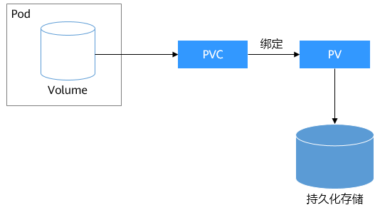

### 2.2 CSI

Kubernetes提供了CSI接口（Container Storage Interface，容器存储接口），基于CSI这套接口，可以开发定制出CSI插件，从而支持特定的存储，达到解耦的目的。例如在[Namespace：资源分组](https://support.huaweicloud.com/basics-cce/kubernetes_0012.html)中看到的kube-system命名空间下everest-csi-controller和everest-csi-driver就是华为云CCE开发存储控制器和驱动。有了这些驱动就可以使用华为云上的EVS、SFS、OBS存储。

```
$ kubectl get po --namespace=kube-system
NAME                                      READY   STATUS    RESTARTS   AGE
everest-csi-controller-6d796fb9c5-v22df   2/2     Running   0          9m11s
everest-csi-driver-snzrr                  1/1     Running   0          12m
everest-csi-driver-ttj28                  1/1     Running   0          12m
everest-csi-driver-wtrk6                  1/1     Running   0          12m
```

### 2.3 PV

来看一下PV是如何描述持久化存储，例如在华为云SFS中创建了一个文件存储，这个文件存储ID为68e4a4fd-d759-444b-8265-20dc66c8c502，挂载地址为sfs-nas01.cn-north-4b.myhuaweicloud.com:/share-96314776。如果想在CCE中使用这个文件存储，则需要先创建一个PV来描述这个存储，如下所示。

```yaml
apiVersion: v1
kind: PersistentVolume
metadata:
  name: pv-example
spec:
  accessModes:
  - ReadWriteMany                      # 读写模式
  capacity:
    storage: 10Gi                      # 定义PV的大小
  csi:
    driver: nas.csi.everest.io         # 声明使用的驱动   
    fsType: nfs                        # 存储类型
    volumeAttributes:
      everest.io/share-export-location: sfs-nas01.cn-north-4b.myhuaweicloud.com:/share-96314776   # 挂载地址
    volumeHandle: 68e4a4fd-d759-444b-8265-20dc66c8c502                                            # 存储ID
```

这里csi下面的内容就是华为云CCE中特定的字段，在其他地方无法使用。

下面创建这个PV并查看。

```
$ kubectl create -f pv.yaml
persistentvolume/pv-example created

$ kubectl get pv
NAME                 CAPACITY   ACCESS MODES   RECLAIM POLICY   STATUS      CLAIM    STORAGECLASS   REASON   AGE
pv-example           10Gi       RWX            Retain           Available                                    4s
```

RECLAIM POLICY是指PV的回收策略，Retain表示PVC被释放后PV继续保留。STATUS值为Available，表示PV处于可用的状态。

### 2.4 PVC

PVC可以绑定一个PV，示例如下。

```yaml
apiVersion: v1
kind: PersistentVolumeClaim
metadata:
  name: pvc-example
spec:
  accessModes:
  - ReadWriteMany
  resources:
    requests:
      storage: 10Gi              # 声明存储的大小
  volumeName: pv-example         # PV的名称
```

创建PVC并查看。

```
$ kubectl create -f pvc.yaml
persistentvolumeclaim/pvc-example created

$ kubectl get pvc
NAME          STATUS   VOLUME       CAPACITY   ACCESS MODES   STORAGECLASS   AGE
pvc-example   Bound    pv-example   10Gi       RWX                           9s
```

这里可以看到状态是Bound，VOLUME是pv-example，表示PVC已经绑定了PV。

再来看下PV。

```
$ kubectl get pv
NAME          CAPACITY   ACCESS MODES   RECLAIM POLICY   STATUS   CLAIM                  STORAGECLASS   REASON   AGE
pv-example    10Gi       RWX            Retain           Bound    default/pvc-example                            50s
```

可以看到状态也变成了Bound，CLAIM是default/pvc-example，表示这个PV绑定了default命名空间下的pvc-example这个PVC。

这里一个比较有意思的地方是CLAIM是default/pvc-example，为什么要显示default呢，这是因为PV是集群级别的资源，并不属于某个命名空间，而PVC是命名空间级别的资源，PV可以与任何命名空间的PVC资源绑定。

**图2**PV与PVC

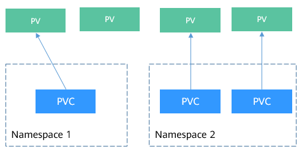

### 2.5 StorageClass

上节说的PV和PVC方法虽然能实现屏蔽底层存储，但是PV创建比较复杂（可以看到PV中csi字段的配置很麻烦），通常都是由集群管理员管理，这非常不方便。

Kubernetes解决这个问题的方法是提供动态配置PV的方法，可以自动创PV。管理员可以部署PV配置器（provisioner），然后定义对应的StorageClass，这样开发者在创建PVC的时候就可以选择需要创建存储的类型，PVC会把StorageClass传递给PV provisioner，由provisioner自动创建PV。如CCE就提供csi-disk、csi-nas、csi-obs等StorageClass，在声明PVC时加上StorageClassName，就可以自动创建PV，并自动创建底层的存储资源。

说明：下面是以CCE 1.15及以上版本集群使用方法举例，1.13以及之前版本集群上使用方法有差异。

执行如下命令即可查询CCE提供的默认StorageClass。您可以使用CCE提供的CSI插件自定义创建StorageClass，但从功能角度与CCE提供的默认StorageClass并无区别，这里不做过多描述。

```
# kubectl get sc
NAME                PROVISIONER                     AGE
csi-disk            everest-csi-provisioner         17d          # 云硬盘 StorageClass
csi-disk-topology   everest-csi-provisioner         17d          # 延迟绑定的云硬盘 StorageClass
csi-nas             everest-csi-provisioner         17d          # 文件存储 StorageClass
csi-obs             everest-csi-provisioner         17d          # 对象存储 StorageClass
csi-sfsturbo        everest-csi-provisioner         17d          # 极速文件存储 StorageClass
```

使用StorageClassName创建PVC。

```yaml
apiVersion: v1
kind: PersistentVolumeClaim
metadata:
  name:  pvc-sfs-auto-example
spec:
  accessModes:
  - ReadWriteMany
  resources:
    requests:
      storage: 10Gi
  storageClassName: csi-nas        # StorageClass
```

创建PVC并查看PVC和PV。

```
$ kubectl create -f pvc2.yaml
persistentvolumeclaim/pvc-sfs-auto-example created

$ kubectl get pvc
NAME                   STATUS   VOLUME                                     CAPACITY   ACCESS MODES   STORAGECLASS   AGE
pvc-sfs-auto-example   Bound    pvc-1f1c1812-f85f-41a6-a3b4-785d21063ff3   10Gi       RWX            csi-nas        29s

$ kubectl get pv
NAME                                       CAPACITY   ACCESS MODES   RECLAIM POLICY   STATUS   CLAIM                         STORAGECLASS   REASON   AGE
pvc-1f1c1812-f85f-41a6-a3b4-785d21063ff3   10Gi       RWO            Delete           Bound    default/pvc-sfs-auto-example  csi-nas                 20s
```

这可以看到使用StorageClass后，不仅创建了PVC，而且创建了PV，并且将二者绑定了。

定义了StorageClass后，就可以减少创建并维护PV的工作，PV变成了自动创建，作为使用者，只需要在声明PVC时指定StorageClassName即可，这就大大减少工作量。

再次说明，StorageClassName的类型在不同厂商的产品上各不相同，这里只是使用了华为云文件存储作为示例。

### 2.6 在pod中使用pvc

有了PVC后，在Pod中使用持久化存储就非常方便了，在Pod Template中的Volume直接关联PVC的名称，然后挂载到容器之中即可，如下所示。甚至在StatefulSet中还可以直接声明PVC，详情请参见[StatefulSet](https://support.huaweicloud.com/basics-cce/kubernetes_0015.html)。

```yaml
apiVersion: apps/v1
kind: Deployment
metadata:
  name: nginx-deployment
spec:
  selector:
    matchLabels:
      app: nginx
  replicas: 2
  template:
    metadata:
      labels:
        app: nginx
    spec:
      containers: 
      - image: nginx:alpine
        name: container-0 
        volumeMounts: 
        - mountPath: /tmp                                # 挂载路径
          name: pvc-sfs-example 
      restartPolicy: Always 
      volumes: 
      - name: pvc-sfs-example 
        persistentVolumeClaim: 
          claimName:  pvc-example
```
