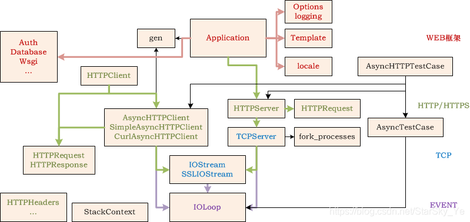

# 入门

## 一、概述

Tornado是一个Python的web框架，是异步方式的Web服务器，速度很快。

## 二、第一个Tornado服务器

### 最简单模式

代码如下

```python
from tornado import ioloop,web
from tornado.options import define,options,parse_command_line

class Home (web.RequestHandler):
    def get(self):
        self.write("hello!get")

def make_app():
    return web.Application(handlers=[
        (r"/",Home),
        ])

if __name__ == "__main__":
    # 定义终端参数
    define("host", default="127.0.0.1", type=str)
    define("port", default=8000, type=int)
    # 解析终端启动命令 格式xx.py --port=端口号 --host=监听地址
    parse_command_line()
    # 创建application实例
    app = make_app()
    app.listen(address=options.host,port=options.port)
    ioloop.IOLoop.current().start()
```

### 公司用的模式(带终端运行)

这里主要注意几点

- 使用一个list管理路由，这样具有扩展性
- 使用parse_command_line可以增加启动参数，终端运行

```python
from tornado import ioloop,web
from tornado.options import define,options,parse_command_line


class Home(web.RequestHandler):
    def get(self):
        self.write("hello!")

# 路由列表
# 这里可以体现restful风格
urls = [
    (r"/", Home)
]

if __name__ == "__main__":
    # 定义终端参数
    define("host", default="127.0.0.1", type=str)
    define("port", default=9999, type=int)
    # 解析终端启动命令 格式xx.py --port=端口号 --host=监听地址
    parse_command_line()
    # 创建application实例
    app = web.Application(urls)
    app.listen(address=options.host,port=options.port)
    ioloop.IOLoop.current().start()
```

这里还可以对urls进行划分，再封装一层，deployservice就是这么做的，到后面还可以单独写一个配置文件

主要是把urls配入相关字典

```python
from tornado import ioloop,web
from tornado.options import define,options,parse_command_line


class Home(web.RequestHandler):
    def get(self):
        self.write("hello!")

class Application(web.Application):
    def __init__(self,urls=None,*args,**kwargs):
        kwargs["handlers"] = urls
        super().__init__(*args,**kwargs)

# 路由列表
urls = [
    (r"/", Home)
]

if __name__ == "__main__":
    # 定义终端参数
    define("host", default="127.0.0.1", type=str)
    define("port", default=9999, type=int)
    # 解析终端启动命令 格式xx.py --port=端口号 --host=监听地址
    parse_command_line()
    # 创建application实例
    app = Application(urls)
    app.listen(address=options.host,port=options.port)
    ioloop.IOLoop.current().start()
```

### tornado支持热部署

- 导入autoreload
- 设置字典

知道就可以了，用的不多，要用自己查

### tornado设计图



流程大致如下

- 请求进来先打到RequestHandler
- 然后进application转到处理的具体方法
- 然后通过httpserver传递数据给IO，LOOP
- IO LOOP是个死循环，不断监听获取
- 对于httpserver来说，传递给IO LOOP数据的方式有一个add_handler方法

### tornado多进程启动方式

启动方式通过httpserver

```python
if __name__ == "__main__":
    # 定义终端参数
    define("host", default="127.0.0.1", type=str)
    define("port", default=9999, type=int)
    # 解析终端启动命令 格式xx.py --port=端口号 --host=监听地址
    parse_command_line()
    # 创建application实例
    app = Application(urls)
    server = httpserver.HTTPServer(app)
    server.listen(address=options.host,port=options.port)
    # 如果是0表示进程=cpu核数+1，否则就是直接指定
    server.start(0)
    # app.listen(address=options.host,port=options.port)
    ioloop.IOLoop.current().start()
```

## 三、请求与相应

请求包

`tornado.httputil.HTTPServerRequest`
